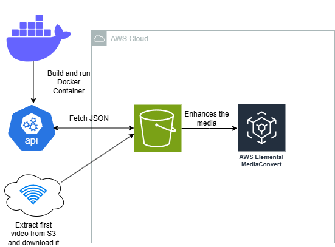

<p align="center">
  
  
## ☁️ 30 Days DevOps Challenge - Converting NCAA Basketball Highlights with Docker, Terraform and Amazon Media Converter.   ☁️

This is part of the fifth project in the 30-day DevOps challenge comprising of two parts. 

In this project, I learned how to convert NCAA Basketball Highlights using Docker, S3, Amazon MediaConvert and deploying Infrastructure as code (Terraform) to push docker containers to an Elastic Container Registry with ECS (Elastic Container Service).


<h2>Environments and Technologies Used</h2>

  - Python
  - Amazon Elastic Container Service
  - Docker
  - RapidAPI
  - Github Codespaces for Environment
  - Terraform
  - IAM
  - Amazon Media Converter
  - S3 


  
<h2>Features</h2>  

- ***Automated Video Processing Pipeline***

**What it does:** Converts raw NCAA match highlights into viewer-ready formats (e.g., MP4, HLS) optimized for phones, tablets, or TVs.

**Why it matters:** Fans get smooth playback on any device without manual editing. Imagine instantly publishing highlights to apps like ESPN or YouTube after a game.

- ***Scalable & Cost-Efficient Cloud Infrastructure***

**AWS MediaConvert**: Transcodes videos without managing servers (pay only for what you process).

**S3 Storage**: Stores raw videos and processed files securely, with automatic versioning and backups.

**Real-world impact**: Handle playoff final traffic spikes without crashing or overpaying for idle servers.


<h2>Step by Step Instructions</h2>

<h2>Part 1 - Deployment using Docker locally</h2>

***1. Set up IAM Roles and Add RapidAPI keys to AWS Secrets Manager***

We will begin by creating the IAM role that will be executing all the actions with permissions AmazonS3FullAccess, MediaConvertFullAccess and AmazonEC2ContainerRegistryFullAccess. We will set a trust policy with the JSON file provided, make sure it's updated to the current AWS account.

```
aws iam create-role \
  --role-name NCAARole \
  --assume-role-policy-document file://trust-policy.json

aws iam attach-role-policy \
  --role-name NCAARole \
  --policy-arn arn:aws:iam::aws:policy/AmazonS3FullAccess

aws iam attach-role-policy \
  --role-name NCAARole \
  --policy-arn arn:aws:iam::aws:policy/AWSElementalMediaConvertFullAccess

aws iam attach-role-policy \
  --role-name NCAARole \
  --policy-arn arn:aws:iam::aws:policy/AmazonEC2ContainerRegistryFullAccess
```

Then, we will add our rapidAPI key to AWS Secrets Manager to use our api key as a secret file.

```
aws secretsmanager create-secret \
    --name RapidAPI2 \
    --description "API key for accessing the Sport Highlights API" \
    --secret-string '{"api_key":"YOUR_ACTUAL_API_KEY"}' \
    --region us-east-1
```

***2. Repo and API configuration***

We will begin by setting up the environment and code that we will be utilizing. In this instance, we will use `Github Codespaces` to create a new workspace and do the commands from there. We will be setting up an account with RapidAPI for the Champions League Highlights.

You can set environemnt variables within the settings of Codespaces. 

The AWS credentials have the variables `AWS_ACCESS_KEY_ID`, `AWS_SECRET_ACCESS_KEY` and `AWS_DEFAULT_REGION` Respectively.


We will proceed with installing the Docker CLI and Docker in Docker

```
curl -fsSL https://download.docker.com/linux/static/stable/x86_64/docker-20.10.9.tgz -o docker.tgz \
tar -xzf docker.tgz \
sudo mv docker/docker /usr/local/bin/ \
rm -rf docker docker.tgz
```

ctrl + p on Github Codespace > Add Dev Container Conf files > modify your active configuration > click on Docker (Docker-in-Docker)


***(Optional): Local AWS CLI Setup***

NOTE: Keep in mind this is for a Linux environment, check the AWS documentation to install it in your supported OS.

   ```
   curl "https://awscli.amazonaws.com/awscli-exe-linux-x86_64.zip" -o "awscliv2.zip"
unzip awscliv2.zip
sudo ./aws/install
```
We then do `AWS configure` and enter our access and secret key along with the region. Output format set to JSON. With this command we will double check that our credentials are put in place for CLI:

```
aws sts get-caller-identity
```


***3. Update .env file and specify Amazon MediaConvert Endpoint ***

In this step, we will make sure our environment variables are set and done, as well as get the endpoint necessary to do the media conversion.

We will begin by grabbing the endpoint with the CLI command:

```
aws mediaconvert describe-endpoints
```

Then, on the .env file, make sure that the variables RAPIDAPI_KEY, AWS_ACCESS_KEY_ID, AWS_SECRET_ACCESS_KEY, S3_BUCKET_NAME are set properly to avoid any errors.

We will also secure the env file:

```
chmod 600 .env
```

***4.  Build and Run the container Locally***

In this step, we will build a docker image that will be deployed locally after we run the command. The API will give the data that we requested and it will convert into a JSON file. Then, the JSON file will be uploaded to S3, which will then go to the media converter and upload back to our bucket with the highlights that we need.

We start by building our docker image:

```
docker build -t highlight-processor .
```

And finally, we run the container.

```
docker run --env-file .env highlight-processor
```

This will run the files that are inside the container, and when successful, you will be able to see the highlights JSON file as well as the video converted.


***5. Final Results***

After running the script, the S3 bucket will be shown like this:


The result of the video converted will appear on AWS Elemental MediaConvert as well:


 <h2>Part 2 - Deployment using Terraform, Elastic Container Service and Elastic Container Registry</h2>

***6. Setting up Terraform along with AWS files***

In this step, we will be setting up the terraform files as well as run our VPC bash script in order to deploy a Networking infrastructure that will be used on our Elastic Container Service Cluster.

We will start by running the vpc_setup.sh on the repo. The script is conformed of AWS CLI commands of the creation our VPC.

```
cd championsleaguegametime/resources \
./vpc_setup.sh
```

We will then store our API key into secrets manager:

```
aws ssm put-parameter \
  --name "/myproject/rapidapi_key" \
  --value "YOUR_SECRET_KEY" \
  --type SecureString
```

You can always get the endpoint of the mediaconverter with this command:

```
aws mediaconvert describe-endpoints
```
NOTE: Leave the mediaconvert_role_arn string empty.


***7. Run Project with Terraform***

In this step, we will run our project using terraform, build our project with Docker and push it to the ECS repository in our AWS account.

We start by pointing to the terraform folder of the repo:

```
cd terraform
```

Then, we will start, check validity of our config file, display and apply our configuration.

```
terraform init
terraform validate
terraform plan
terraform apply -var-file="terraform.dev.tfvars"
```

Next, we will build and push our docker image to ECR.

```
docker build -t highlight-pipeline:latest .
docker tag highlight-pipeline:latest <AWS_ACCOUNT_ID>.dkr.ecr.<REGION>.amazonaws.com/highlight-pipeline:latest
```

```
aws ecr get-login-password --region us-east-1 | \
  docker login --username AWS --password-stdin <AWS_ACCOUNT_ID>.dkr.ecr.us-east-1.amazonaws.com

docker push <AWS_ACCOUNT_ID>.dkr.ecr.<REGION>.amazonaws.com/highlight-pipeline:latest
```
***8. Cleanup***

We will be deleting the role and policies for clean up.

Run the Bash script on the resources folder of the repository (soccerprojectcleanup.sh) to delete all of our resources created.

```
cd resources 
./ncaaprojectcleanup.sh
```

<h2>Conclusion</h2>

In this project, I learned how we can use containers and infrastructure as code to deploy our applications with AWS services like S3 and Amazon MediaConvert, to convert media highlight files queried from our Sports API data.
